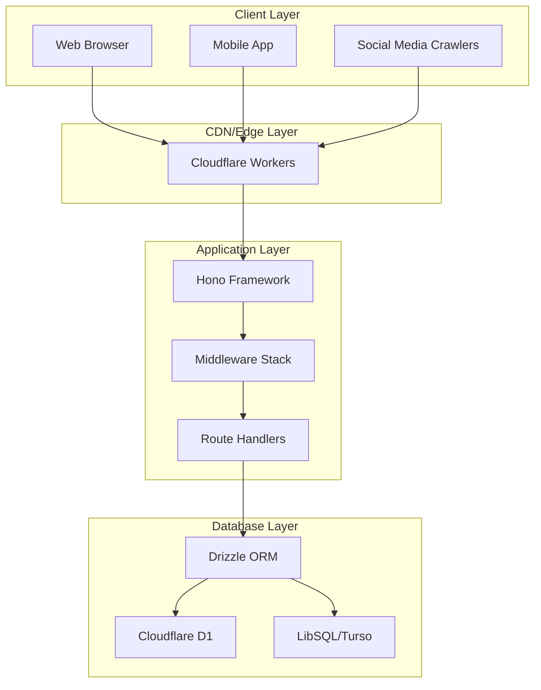

# @cdlab/shortener

A modern short-link service built with Hono, supporting Cloudflare Workers and local development.

## ✨ Features

- 🚀 **High Performance**: Powered by Hono on Cloudflare Workers for edge computing.
- 🗄️ **Database Flexibility**: Supports Cloudflare D1 and LibSQL (Turso).
- 🔐 **Secure Authentication**: JWT (ES256) for API access control.
- 🔗 **Short Link Management**: Create, update, delete short links.
- ⏰ **Expiration Support**: Configurable link expiration.
- 🗑️ **Soft Deletion**: Safe data deletion mechanism.
- 📱 **Social Media Integration**: Auto-detects crawlers and serves OG tags.
- 📊 **Health Monitoring**: Built-in service status checks.
- 📝 **Comprehensive Logging**: Detailed request and operation logs.

## 🏗️ Tech Stack

- **Framework**: [Hono](https://hono.dev/) - Fast, multi-runtime web framework.
- **Runtime**: Cloudflare Workers / Node.js.
- **Database**: Cloudflare D1 / LibSQL (Turso).
- **ORM**: [Drizzle ORM](https://orm.drizzle.team/) - TypeScript-first ORM.
- **Authentication**: JWT (ES256) - Elliptic Curve Digital Signature.
- **Package Manager**: pnpm - Fast, disk-efficient.
- **Type Checking**: TypeScript - Static type safety.
- **Deployment**: Cloudflare Workers - Edge computing platform.

## 🏛️ Architecture

### System Architecture



## 📦 Installation

```bash
# Clone the repository
git clone https://github.com/WuChenDi/shortener.git
cd shortener

# Install dependencies
pnpm install

# Copy environment variables
cp .env.example .env
```

## 🔧 Configuration

### Environment Variables

```bash
# LibSQL Configuration
# The URL for connecting to the LibSQL database. Default is a local SQLite file.
LIBSQL_URL=libsql://your-libsql-database-url

# The authentication token for accessing the LibSQL database.
LIBSQL_AUTH_TOKEN=your-libsql-auth-token

# Database Type
# Specify the type of database being used. Choose 'libsql' for LibSQL or 'd1' for Cloudflare D1.
# This determines which credentials and driver will be used in the configuration.
DB_TYPE=libsql

# JWT_PUBKEY
JWT_PUBKEY=your-jwt-public-key
CDN_URL=your-cdn-url

```

### wrangler.jsonc

```json
{
  "$schema": "node_modules/wrangler/config-schema.json",
  "name": "shortener",
  "main": "src/index.ts",
  "compatibility_date": "2025-07-24",
  "compatibility_flags": [
    "nodejs_compat"
  ],
  "vars": {
    "DB_TYPE": "d1",
    "JWT_PUBKEY": "your-jwt-public-key",
    "CDN_URL": "https://your-cdn-url.com/"
  },
  "d1_databases": [
    {
      "binding": "DB",
      "database_name": "shortener-db",
      "migrations_dir": "./src/database",
      "database_id": "your-database-id-here",
    }
  ],
  "observability": {
    "enabled": true,
    "head_sampling_rate": 1
  }
}

```

**Generate JWT_PUBKEY:**
1. Run `pnpm run generate-jwt` to create key pair.
2. Copy the hex-format public key to `JWT_PUBKEY`.
3. Use the generated JWT token for API testing.

## 🚀 Development

### Generate JWT Key Pair

```bash
pnpm run generate-jwt
```

Outputs:
- ES256 key pair (JWK format).
- Hex-format public key for `wrangler.jsonc`.
- Test JWT token for API testing.

### Local Development (LibSQL)

```bash
# Generate database migrations
pnpm drizzle-kit generate

# Apply migrations to local database
pnpm drizzle-kit migrate

# Start development server
pnpm dev
```

### Cloudflare D1 Development

```bash
# Create D1 database
wrangler d1 create shortener-db

# Generate migrations
pnpm drizzle-kit generate

# Apply migrations to remote D1
pnpm run cf:remotedb

# Start development with remote D1
pnpm run dev:remote
```

## 📚 API Documentation

### Authentication

All `/api/*` routes require JWT authentication:

```bash
Authorization: Bearer <your-jwt-token>
```

Generate token:
```bash
pnpm run generate-jwt
```

### Health Check

**GET /**

```json
{
  "service": "@cdlab/shortener",
  "status": "healthy",
  "timestamp": "2025-07-24T07:48:52.267Z",
  "version": "1.0.0",
  "database": {
    "type": "d1",
    "status": "connected"
  },
  "environment": {
    "nodeEnv": "production",
    "debug": false
  }
}
```

### Short Link Management

#### List Links

**GET /api/url**

Query parameters:
- `isDeleted`: Optional (0 = active, 1 = deleted)

Response:
```json
{
  "code": 0,
  "message": "ok",
  "data": [
    {
      "id": 1,
      "url": "https://example.com",
      "userId": "user123",
      "hash": "abc123",
      "expiresAt": null,
      "createdAt": "2025-07-24T07:48:52.267Z",
      "updatedAt": "2025-07-24T07:48:52.267Z"
    }
  ]
}
```

#### Create Short Link

**POST /api/url**

Request body:
```json
{
  "records": [
    {
      "url": "https://example.com",
      "userId": "user123",
      "hash": "abc123",
      "expiresAt": null,
      "attribute": null
    }
  ]
}
```

#### Update Short Link

**PUT /api/url**

Request body:
```json
{
  "records": [
    {
      "hash": "abc123",
      "url": "https://new-url.com",
      "userId": "user123",
      "expiresAt": null,
      "attribute": null
    }
  ]
}
```

#### Delete Short Link (Soft Delete)

**DELETE /api/url**

Request body:
```json
{
  "hashList": ["abc123", "def456"]
}
```

### Short Link Access

#### Redirect to Target URL

**GET /:shortCode**

Redirects to the target URL. Supports social media crawler detection.

#### OG Tags Page

**GET /:shortCode/og**

Serves HTML with OG tags for social media crawlers.

## 🗄️ Database Schema

### `links` Table

| Field       | Type    | Description                  |
|-------------|---------|------------------------------|
| id          | INTEGER | Primary key, auto-increment   |
| url         | TEXT    | Target URL                   |
| userId      | TEXT    | User ID                      |
| hash        | TEXT    | Unique short link hash       |
| expiresAt   | INTEGER | Expiration timestamp         |
| attribute   | BLOB    | Additional attributes (JSON) |
| createdAt   | INTEGER | Creation timestamp           |
| updatedAt   | INTEGER | Update timestamp             |
| isDeleted   | INTEGER | Soft delete flag (0/1)       |

### `pages` Table

| Field       | Type    | Description                  |
|-------------|---------|------------------------------|
| id          | INTEGER | Primary key, auto-increment   |
| userId      | TEXT    | User ID                      |
| template    | TEXT    | Page template                |
| data        | BLOB    | Page data                    |
| hash        | TEXT    | Unique page hash             |
| expiresAt   | INTEGER | Expiration timestamp         |
| attribute   | BLOB    | Additional attributes        |
| createdAt   | INTEGER | Creation timestamp           |
| updatedAt   | INTEGER | Update timestamp             |
| isDeleted   | INTEGER | Soft delete flag (0/1)       |

## 🛠️ Utility Functions

### Database Utilities (`db-utils.ts`)

- `notDeleted()`: Filters non-deleted records.
- `softDelete()`: Performs soft deletion.
- `withNotDeleted()`: Applies soft delete filter to queries.
- `withUpdatedTimestamp()`: Updates timestamps automatically.
- `isExpired()`: Checks for expiration.

## 📈 Deployment

### Cloudflare Workers

```bash
# Build and deploy
pnpm run deploy

# Preview deployment
pnpm run preview
```

## 📜 License

[MIT](./LICENSE) License &copy; 2023-PRESENT [wudi](https://github.com/WuChenDi)
