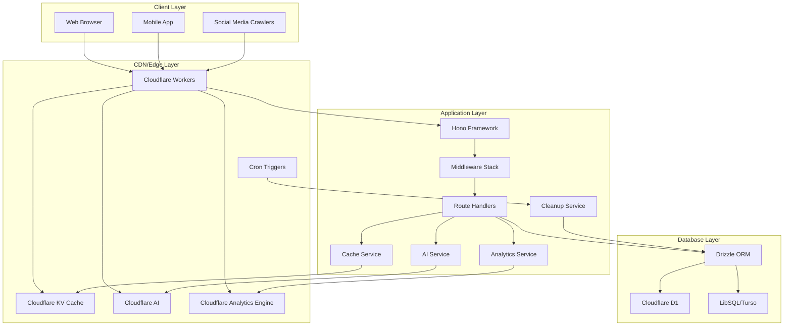

# shortener

A URL shortener service built with Cloudflare Workers and Hono.

- **Tips**: For information about OpenAPI and Swagger, please refer to the [feat/swagger-openapi](https://github.com/WuChenDi/shortener/tree/feat/swagger-openapi) branch.

## ✨ Features

- 🚀 **High Performance**: Powered by Hono on Cloudflare Workers for edge computing.
- 🗄️ **Database Flexibility**: Supports Cloudflare D1 and LibSQL (Turso).
- 🔐 **Secure Authentication**: JWT (ES256) for API access control.
- 🔗 **Short Link Management**: Create, update, delete short links.
- ⏰ **Expiration Support**: Configurable link expiration.
- 🗑️ **Soft Deletion**: Safe data deletion mechanism.
- 📱 **Social Media Integration**: Auto-detects crawlers and serves OG tags.
- 📊 **Health Monitoring**: Built-in service status checks.
- 📝 **Comprehensive Logging**: Detailed request and operation logs.
- ⚡ **KV Caching**: Cloudflare KV-based caching for high-performance URL resolution.
- 🔀 **Optimized Hash Generation**: Base62 + timestamp algorithm for collision reduction.
- 🕐 **Automated Cleanup**: Daily scheduled task to clean up expired links.
- 🤖 **AI-Driven Slug Generation**: Semantic short codes using Cloudflare AI.
- 📈 **Analytics**: Track and analyze short link performance with Cloudflare Analytics Engine.

## 🏗️ Tech Stack

- **Framework**: [Hono](https://hono.dev/) - Fast, multi-runtime web framework.
- **Runtime**: Cloudflare Workers / Node.js.
- **Database**: Cloudflare D1 / LibSQL (Turso).
- **Cache**: Cloudflare KV - Edge key-value storage.
- **ORM**: [Drizzle ORM](https://orm.drizzle.team/) - TypeScript-first ORM.
- **Authentication**: JWT (ES256) - Elliptic Curve Digital Signature.
- **AI**: Cloudflare AI - For semantic slug generation.
- **Analytics**: Cloudflare Analytics Engine - For tracking link performance.
- **Package Manager**: pnpm - Fast, disk-efficient.
- **Type Checking**: TypeScript - Static type safety.
- **Deployment**: Cloudflare Workers - Edge computing platform.
- **Scheduled Tasks**: Cloudflare Cron Triggers - Automated maintenance.

## 🏛️ Architecture

### System Architecture



### Caching Strategy

The service implements a multi-layer caching strategy:

1. **KV Cache Layer**: Primary cache using Cloudflare KV
   - URL data cached for 1 hour
   - OG page HTML cached for 1 hour
   - AI-generated slugs cached for 1 hour
   - Automatic cache invalidation on updates/deletions

2. **Cache Keys**:
   - URL data: `url:{hash}`
   - OG pages: `og:{hash}`
   - AI slugs: `ai:slug:{url}`

3. **Cache Flow**:
   - Read: Cache → Database/AI (on miss)
   - Write: Database/AI → Cache
   - Update: Database → Cache invalidation
   - Delete: Database → Cache invalidation

### Scheduled Tasks

The service includes automated maintenance through Cloudflare Cron Triggers:

1. **Daily Cleanup Task**: Runs every day at midnight (00:00 UTC)
   - Identifies expired links automatically
   - Performs soft deletion to maintain data integrity
   - Clears associated KV cache entries
   - Processes links in batches to prevent system overload

2. **Cleanup Process**:
   - Query expired links: `WHERE isDeleted = 0 AND expiresAt < current_time`
   - Batch processing: 50 links per batch with 100ms delays
   - Soft delete: Updates `isDeleted = 1` and `updatedAt = now()`
   - Cache cleanup: Removes `url:{hash}`, `og:{hash}`, and `ai:slug:{url}` entries
   - Error handling: Individual failures don't stop the entire process

## 📦 Installation

```bash
# Clone the repository
git clone https://github.com/WuChenDi/shortener.git
cd shortener

# Install dependencies
pnpm install

# Copy environment variables
cp .env.example .env
```

## 🔧 Configuration

### Environment Variables

```bash
# The Service runtime preset to use for deployment.
# Options include:
# - 'cf': For deploying to Cloudflare.
# - 'node': For using the Node.js runtime.
# This variable allows you to dynamically select the appropriate runtime environment
# based on your deployment target.
DEPLOY_RUNTIME=cf

# Database Type
# Specify the type of database being used. Choose 'libsql' for LibSQL or 'd1' for Cloudflare D1.
# This determines which credentials and driver will be used in the configuration.
DB_TYPE=libsql

# LibSQL Configuration
# The URL for connecting to the LibSQL database. Default is a local SQLite file.
LIBSQL_URL=libsql://your-libsql-database-url
# The authentication token for accessing the LibSQL database.
LIBSQL_AUTH_TOKEN=your-libsql-auth-token

# Cloudflare Configuration
# The Cloudflare account ID for accessing Cloudflare services.
CLOUDFLARE_ACCOUNT_ID=
# The Cloudflare API token for authentication and authorization.
CLOUDFLARE_API_TOKEN=

# The public key for JWT verification
JWT_PUBKEY=your-jwt-public-key

# AI Functional Configuration
ENABLE_AI_SLUG=true
AI_MODEL=@cf/meta/llama-3.1-8b-instruct
AI_ENABLE_CACHE=true
AI_MAX_RETRIES=3
AI_TIMEOUT=10000

# Analytics Engine Configuration
ANALYTICS_DATASET=shortener_analytics
ANALYTICS_SAMPLE_RATE=1.0
DISABLE_BOT_ANALYTICS=false

```

### wrangler.jsonc

```json
{
  "$schema": "node_modules/wrangler/config-schema.json",
  "name": "shortener",
  "main": "src/index.ts",
  "compatibility_date": "2025-07-24",
  "compatibility_flags": [
    "nodejs_compat"
  ],
  "vars": {
    // The Service runtime preset to use for deployment.
    "DEPLOY_RUNTIME": "cf",
    // Database Type
    "DB_TYPE": "d1",
    // LibSQL Configuration
    // The URL for connecting to the LibSQL database. Default is a local SQLite file.
    "LIBSQL_URL": "your-libsql-url",
    // The authentication token for accessing the LibSQL
    "LIBSQL_AUTH_TOKEN": "your-libsql-auth-token",

    // Cloudflare Configuration
    // The Cloudflare account ID for accessing Cloudflare services.
    "CLOUDFLARE_ACCOUNT_ID": "your-cloudflare-account-id",
    // The Cloudflare API token for authentication and authorization.
    "CLOUDFLARE_API_TOKEN": "your-cloudflare-api-token",

    // The public key for JWT verification
    "JWT_PUBKEY": "your-jwt-public-key",

    // AI Functional Configuration
    "ENABLE_AI_SLUG": "true",
    "AI_MODEL": "@cf/meta/llama-3.1-8b-instruct",
    "AI_ENABLE_CACHE": "true",
    "AI_MAX_RETRIES": "3",
    "AI_TIMEOUT": "10000",

    // Analytics Engine Configuration
    "ANALYTICS_DATASET": "shortener_analytics",
    "ANALYTICS_SAMPLE_RATE": "1.0",
    "DISABLE_BOT_ANALYTICS": "false"
  },
  "d1_databases": [
    {
      "binding": "DB",
      "database_name": "shortener-db",
      "migrations_dir": "./src/database",
      "database_id": "your-database-id-here"
    }
  ],
  "kv_namespaces": [
    {
      "binding": "SHORTENER_KV",
      "id": "your-kv-namespace-id-here"
    }
  ],
  "ai": {
    "binding": "AI"
  },
  "analytics_engine_datasets": [
    {
      "binding": "ANALYTICS",
      "dataset": "shortener_analytics"
    }
  ],
  "triggers": {
    "crons": [
      "0 0 * * *"
    ]
  },
  "observability": {
    "enabled": true,
    "head_sampling_rate": 1
  }
}
```

**Cron Schedule Configuration:**
- `"0 0 * * *"`: Daily at midnight (00:00 UTC)
- Format: `minute hour day month dayOfWeek`
- Alternative schedules:
  - `"0 2 * * *"`: Daily at 2:00 AM
  - `"0 0 */7 * *"`: Weekly at midnight
  - `"0 0 1 * *"`: Monthly on the 1st

**Generate JWT_PUBKEY:**
1. Run `pnpm run generate-jwt` to create key pair.
2. Copy the hex-format public key to `JWT_PUBKEY`.
3. Use the generated JWT token for API testing.

**Setup Cloudflare KV:**
1. Create KV namespace: `wrangler kv:namespace create "SHORTENER_KV"`
2. Update the `id` in `wrangler.jsonc` with the returned namespace ID.

**Setup Cloudflare Analytics Engine:**
1. Create Analytics Engine dataset: `wrangler analytics:dataset create shortener_analytics`
2. Update the `analytics_engine_datasets` in `wrangler.jsonc` with the dataset name.

## 🚀 Development

### Generate JWT Key Pair

```bash
pnpm run generate-jwt
```

Outputs:
- ES256 key pair (JWK format).
- Hex-format public key for `wrangler.jsonc`.
- Test JWT token for API testing.

### Setup KV Namespace

```bash
# Create KV namespace for development
wrangler kv:namespace create "SHORTENER_KV"

# Create KV namespace for production
wrangler kv:namespace create "SHORTENER_KV" --preview false
```

### Setup Analytics Engine

```bash
# Create Analytics Engine dataset
wrangler analytics:dataset create shortener_analytics
```

### Local Development (LibSQL)

```bash
# Generate database migrations
pnpm drizzle-kit generate

# Apply migrations to local database
pnpm drizzle-kit migrate

# Start development server
pnpm dev
```

### Cloudflare D1 Development

```bash
# Create D1 database
wrangler d1 create shortener-db

# Create KV namespace
wrangler kv:namespace create "SHORTENER_KV"

# Create Analytics Engine dataset
wrangler analytics:dataset create shortener_analytics

# Generate migrations
pnpm drizzle-kit generate

# Apply migrations to remote D1
pnpm run cf:remotedb

# Start development with remote D1
pnpm run dev:remote
```

## 📚 API Documentation

### Authentication

All `/api/*` routes require JWT authentication:

```bash
Authorization: Bearer <your-jwt-token>
```

Generate token:
```bash
pnpm run generate-jwt
```

### Health Check

**GET /**

```json
{
  "service": "shortener",
  "status": "healthy",
  "timestamp": "2025-07-24T10:36:20.768Z",
  "version": "1.0.0"
}
```

### Short Link Management

#### List Links

**GET /api/url**

Query parameters:
- `isDeleted`: Optional (0 = active, 1 = deleted)

Response:
```json
{
  "code": 0,
  "message": "ok",
  "data": [
    {
      "id": 3,
      "url": "https://bit.ly/m/wuchendi",
      "userId": "",
      "expiresAt": 1753356199203,
      "hash": "f6b0c8f15eb1ca108ba7002e3eb97ef180d5de85eeac92ab20a43719fb9a683a",
      "shortCode": "X82qSitG",
      "domain": "shortener.cdlab.workers.dev",
      "attribute": null,
      "createdAt": "2025-07-24T10:23:19.000Z",
      "updatedAt": "2025-07-24T10:23:19.000Z",
      "isDeleted": 0
    }
  ]
}
```

#### Create Short Link

**POST /api/url**

Request body:
```json
{
  "records": [
    {
      "url": "https://bit.ly/m/wuchendi", // Required, target URL
      "userId": "wudi", // Optional, default is an empty string
      "hash": "zCwixTtm", // Optional, custom short code (auto-generated using Base62+timestamp or AI if not provided)
      "expiresAt": null, // Optional, default is 1 hour from now (timestamp in milliseconds)
      "attribute": null // Optional, additional attributes as JSON
    }
  ]
}
```

Response:
```json
{
  "code": 0,
  "message": "ok",
  "data": {
    "successes": [
      {
        "hash": "f6b0c8f15eb1ca108ba7002e3eb97ef180d5de85eeac92ab20a43719fb9a683a",
        "shortCode": "X82qSitG",
        "shortUrl": "https://shortener.cdlab.workers.dev/X82qSitG",
        "success": true,
        "url": "https://bit.ly/m/wuchendi",
        "expiresAt": 1753356378707
      }
    ],
    "failures": []
  }
}
```

**Note**: When creating URLs, the service automatically caches the new entries in KV for improved performance.

#### Update Short Link

**PUT /api/url**

Request body:
```json
{
  "records": [
    {
      "hash": "f6b0c8f15eb1ca108ba7002e3eb97ef180d5de85eeac92ab20a43719fb9a683a", // Required, the internal hash of the link to update (not the shortCode)
      "url": "https://new-url.com", // Optional, new target URL
      "userId": "user456", // Optional, new user ID
      "expiresAt": 1721808000000, // Optional, new expiration timestamp (milliseconds)
      "attribute": {"updated": true, "category": "work"} // Optional, new additional attributes
    }
  ]
}
```

**Note**: Updating URLs automatically invalidates the corresponding cache entries.

#### Delete Short Link (Soft Delete)

**DELETE /api/url**

Request body:
```json
{
  "hashList": ["f6b0c8f15eb1ca108ba7002e3eb97ef180d5de85eeac92ab20a43719fb9a683a", "uXbVgEX1abc..."]
}
```

Response:
```json
{
  "code": 0,
  "message": "ok",
  "data": {
    "successes": [
        {
          "hash": "uXbVgEX1",
          "success": true
        }
    ],
    "failures": [
      {
        "hash": "nqmSGVbv",
        "success": false,
        "error": "Record not found or already deleted"
      }
    ]
  }
}
```

**Note**: Deleting URLs removes `url:{hash}`, `og:{hash}`, and `ai:slug:{url}` cache entries.

### AI-Driven Slug Generation

#### Generate Semantic Slug

**POST /api/ai/slug**

Generates a semantic short code using Cloudflare AI based on the target URL's content.

Request body:
```json
{
  "url": "https://bit.ly/m/wuchendi", // Required, target URL
  "maxLength": 10, // Optional, maximum length of the slug (default: 8)
  "language": "en" // Optional, language for slug generation (default: en)
}
```

Response:
```json
{
  "code": 0,
  "message": "ok",
  "data": {
    "slug": "WuChenDi",
    "confidence": 0.95,
    "shortUrl": "https://shortener.cdlab.workers.dev/WuChenDi"
  }
}
```

**Features**:
- Uses Cloudflare AI (`@cf/meta/llama-3-8b-instruct`) to generate meaningful slugs based on URL content or metadata.
- Caches AI-generated slugs in KV (`ai:slug:{url}`) for 1 hour to reduce API calls.
- Validates slugs against a regex pattern (e.g., alphanumeric, 4-10 characters).
- Fallback to Base62+timestamp algorithm if AI generation fails.
- Configurable timeout (`AI_TIMEOUT`) and retry (`AI_MAX_RETRIES`) settings.

**Performance**:
- AI response cached to minimize latency.
- Automatic cache invalidation on URL updates or deletions.
- Error handling for invalid AI responses or timeouts.

### Analytics

#### Retrieve Analytics Data

**GET /api/analytics**

Fetches performance metrics for short links using Cloudflare Analytics Engine.

Query parameters:
- `shortCode`: Optional, filter by specific short code
- `startTime`: Required, start timestamp (ISO 8601 or Unix milliseconds)
- `endTime`: Required, end timestamp (ISO 8601 or Unix milliseconds)
- `interval`: Optional, aggregation interval (e.g., `1h`, `1d`, default: `1h`)
- `timezone`: Optional, timezone for time-based aggregation (default: `UTC`)
- `dimensions`: Optional, comma-separated list of dimensions (e.g., `country,device,browser`)
- `limit`: Optional, maximum number of results (default: 1000)

Response:
```json
{
  "code": 0,
  "message": "ok",
  "data": {
    "timeseries": [
      {
        "timeLabel": "2025-07-24T10:00:00Z",
        "clicks": 150,
        "country": "US",
        "device": "desktop",
        "browser": "Chrome"
      },
      {
        "timeLabel": "2025-07-24T11:00:00Z",
        "clicks": 120,
        "country": "US",
        "device": "mobile",
        "browser": "Safari"
      }
    ],
    "totals": {
      "clicks": 270,
      "uniqueVisitors": 200
    }
  }
}
```

**Features**:
- Powered by Cloudflare Analytics Engine for high-performance queries.
- Supports multiple dimensions: `country`, `device`, `browser`, `referrer`, `os`.
- Bot filtering to exclude automated traffic (based on `User-Agent`).
- Sampling rate configuration to balance accuracy and performance.
- Sanitized SQL inputs to prevent injection attacks.
- Cached query results in KV for 5 minutes to reduce Analytics Engine load.

**Performance**:
- Optimized for large datasets with batch processing and sampling.
- Cache layer reduces repetitive queries.
- Dynamic SQL generation for flexible dimension combinations.

**Example Query**:
```bash
GET /api/analytics?shortCode=X82qSitG&startTime=2025-07-24T00:00:00Z&endTime=2025-07-25T00:00:00Z&dimensions=country,device&interval=1h
```

## 🗄️ Database Schema

### `links` Table

| Field       | Type    | Description                  |
|-------------|---------|------------------------------|
| id          | INTEGER | Primary key, auto-increment   |
| url         | TEXT    | Target URL                   |
| userId      | TEXT    | User ID                      |
| hash        | TEXT    | Unique internal hash for security |
| shortCode   | TEXT    | User-facing short code (Base62 or AI-generated) |
| domain      | TEXT    | Domain name for multi-tenant support |
| expiresAt   | INTEGER | Expiration timestamp         |
| attribute   | BLOB    | Additional attributes (JSON) |
| createdAt   | INTEGER | Creation timestamp           |
| updatedAt   | INTEGER | Update timestamp             |
| isDeleted   | INTEGER | Soft delete flag (0/1)       |

**Indexes:**
- `links_hash` (unique): On `hash` field for internal queries
- `links_short_code_domain` (unique): On `shortCode + domain` for URL resolution

### `pages` Table

| Field       | Type    | Description                  |
|-------------|---------|------------------------------|
| id          | INTEGER | Primary key, auto-increment   |
| userId      | TEXT    | User ID                      |
| template    | TEXT    | Page template                |
| data        | BLOB    | Page data                    |
| hash        | TEXT    | Unique page hash             |
| expiresAt   | INTEGER | Expiration timestamp         |
| attribute   | BLOB    | Additional attributes        |
| createdAt   | INTEGER | Creation timestamp           |
| updatedAt   | INTEGER | Update timestamp             |
| isDeleted   | INTEGER | Soft delete flag (0/1)       |

## 🛠️ Utility Functions

### Database Utilities (`db-utils.ts`)

- `notDeleted()`: Filters non-deleted records.
- `softDelete()`: Performs soft deletion.
- `withNotDeleted()`: Applies soft delete filter to queries.
- `withUpdatedTimestamp()`: Updates timestamps automatically.
- `isExpired()`: Checks for expiration.

### Hash Generation (`hash.ts`)

- `generateRandomHash()`: Optimized Base62 + timestamp hash generation.
- `toBase62()`: Converts numbers to Base62 encoding.
- `generateHashFromDomainAndCode()`: Creates domain-specific hashes.

### AI Utilities (`slug.ts`)

- `generateAISlug()`: Calls Cloudflare AI to generate semantic slugs.
- `parseAIResponse()`: Validates and parses AI-generated slug responses.
- `cacheAISlug()`: Caches AI slugs in KV with `ai:slug:{url}` keys.
- `validateSlug()`: Ensures slugs meet length and pattern requirements.

### Analytics Utilities (`analytics.ts`)

- `sanitizeSqlInput()`: Prevents SQL injection in Analytics Engine queries.
- `buildWhereConditions()`: Dynamically constructs SQL WHERE clauses.
- `getIntervalFormat()`: Maps intervals to SQL-compatible formats.
- `isBot()`: Filters bot traffic based on `User-Agent`.

### Cleanup Service (`cron/cleanup.ts`)

- `cleanupExpiredLinks()`: Automated expired link cleanup function.
- **Batch Processing**: Handles large datasets efficiently (50 links per batch).
- **Error Resilience**: Individual failures don't stop the entire cleanup process.
- **Comprehensive Logging**: Detailed execution statistics and error reporting.
- **Cache Synchronization**: Automatically clears `url:{hash}`, `og:{hash}`, and `ai:slug:{url}` cache entries.

## ⚡ Performance Optimizations

### Caching Strategy

1. **Multi-layer Caching**: KV cache → Database/AI/Analytics Engine fallback
2. **Smart Invalidation**: Automatic cache clearing on updates/deletions
3. **TTL Management**: 1-hour cache expiration for URLs, OG pages, and AI slugs; 5-minute expiration for analytics queries
4. **Separate Cache Keys**: Different cache strategies for URLs, OG pages, AI slugs, and analytics

### Hash Algorithm

1. **Collision Reduction**: Base62 + timestamp approach reduces conflicts by ~99%
2. **Retry Mechanism**: Automatic collision detection with fallback generation
3. **AI Fallback**: Uses AI-generated slugs when requested
4. **Time-based Ordering**: Improves cache locality and database performance
5. **Configurable Length**: Default 8 characters with dynamic extension on conflicts

### Analytics Optimization

1. **Query Efficiency**: Dynamic SQL generation for flexible analytics queries
2. **Bot Filtering**: Excludes automated traffic for accurate metrics
3. **Sampling**: Configurable sampling rate to balance accuracy and performance
4. **Caching**: 5-minute KV cache for repetitive analytics queries

### Automated Maintenance

1. **Scheduled Cleanup**: Daily automated cleanup prevents database bloat
2. **Resource Efficiency**: Batch processing with delays prevents system overload
3. **Monitoring Ready**: Comprehensive logging for maintenance tracking
4. **Cache Coherence**: Synchronized cache invalidation during cleanup

## 📊 Monitoring & Maintenance

### Scheduled Task Monitoring

After deployment, you can monitor the cleanup task execution in Cloudflare Workers logs:

```bash
# View recent logs
wrangler tail

# Filter for cleanup task logs
wrangler tail --grep "cleanup"
```

**Expected Log Output:**
```json
{
  "message": "Scheduled cleanup task completed",
  "deletedCount": 42,
  "cacheCleanedCount": 42,
  "errorCount": 0,
  "executionTimeMs": 1250,
  "scheduledTime": "2025-07-25T00:00:00.000Z"
}
```

### Performance Metrics

The cleanup task provides detailed metrics:
- **Execution Time**: Total time spent on cleanup
- **Deleted Count**: Number of links soft-deleted
- **Cache Cleaned Count**: Number of cache entries removed
- **Error Count**: Number of failures (with detailed error messages)
- **Batch Processing**: Efficient handling of large datasets

### Analytics Monitoring

Monitor analytics query performance via Cloudflare Workers logs:

```bash
# Filter for analytics logs
wrangler tail --grep "analytics"
```

**Expected Log Output:**
```json
{
  "message": "Analytics query executed",
  "query": "SELECT timeLabel, clicks FROM shortener_analytics WHERE shortCode = 'X82qSitG'",
  "executionTimeMs": 150,
  "resultCount": 24,
  "cacheHit": false
}
```

### Customizing Cleanup Schedule

To modify the cleanup frequency, update the cron expression in `wrangler.jsonc`:

```json
"triggers": {
  "crons": [
    "0 0 * * *"    // Daily at midnight
    // "0 */12 * * *"  // Every 12 hours
    // "0 0 * * 0"     // Weekly on Sunday
    // "0 0 1 * *"     // Monthly on 1st day
  ]
}
```

## 📈 Deployment

### Cloudflare Workers

```bash
# Build and deploy
pnpm run deploy
```

**Post-Deployment Checklist:**
- ✅ Verify scheduled task is active in Cloudflare Dashboard
- ✅ Check initial cleanup execution in logs
- ✅ Monitor cleanup task performance metrics
- ✅ Validate cache synchronization after cleanup
- ✅ Test AI slug generation endpoint
- ✅ Verify analytics data collection and query performance

## 📜 License

[MIT](./LICENSE) License &copy; 2023-PRESENT [wudi](https://github.com/WuChenDi)
