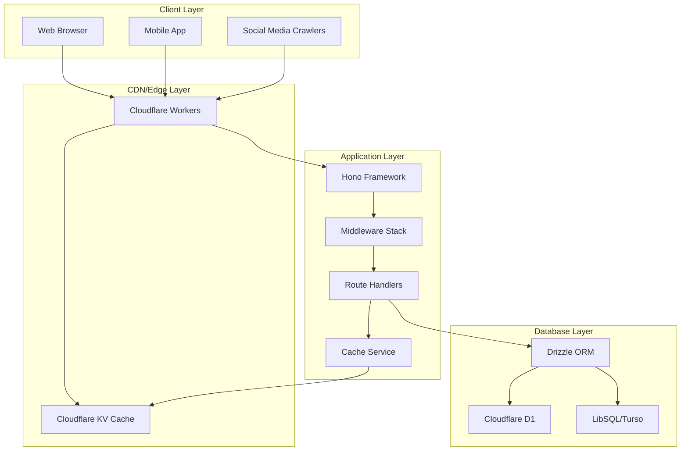

# shortener

A URL shortener service built with Cloudflare Workers and Hono.

- **Tips**: For information about OpenAPI and Swagger, please refer to the [feat/swagger-openapi](https://github.com/WuChenDi/shortener/tree/feat/swagger-openapi) branch.

## ✨ Features

- 🚀 **High Performance**: Powered by Hono on Cloudflare Workers for edge computing.
- 🗄️ **Database Flexibility**: Supports Cloudflare D1 and LibSQL (Turso).
- 🔐 **Secure Authentication**: JWT (ES256) for API access control.
- 🔗 **Short Link Management**: Create, update, delete short links.
- ⏰ **Expiration Support**: Configurable link expiration.
- 🗑️ **Soft Deletion**: Safe data deletion mechanism.
- 📱 **Social Media Integration**: Auto-detects crawlers and serves OG tags.
- 📊 **Health Monitoring**: Built-in service status checks.
- 📝 **Comprehensive Logging**: Detailed request and operation logs.
- ⚡ **KV Caching**: Cloudflare KV-based caching for high-performance URL resolution.
- 🔀 **Optimized Hash Generation**: Base62 + timestamp algorithm for collision reduction.

## 🏗️ Tech Stack

- **Framework**: [Hono](https://hono.dev/) - Fast, multi-runtime web framework.
- **Runtime**: Cloudflare Workers / Node.js.
- **Database**: Cloudflare D1 / LibSQL (Turso).
- **Cache**: Cloudflare KV - Edge key-value storage.
- **ORM**: [Drizzle ORM](https://orm.drizzle.team/) - TypeScript-first ORM.
- **Authentication**: JWT (ES256) - Elliptic Curve Digital Signature.
- **Package Manager**: pnpm - Fast, disk-efficient.
- **Type Checking**: TypeScript - Static type safety.
- **Deployment**: Cloudflare Workers - Edge computing platform.

## 🏛️ Architecture

### System Architecture



### Caching Strategy

The service implements a multi-layer caching strategy:

1. **KV Cache Layer**: Primary cache using Cloudflare KV
   - URL data cached for 1 hour
   - OG page HTML cached for 1 hour
   - Automatic cache invalidation on updates/deletions

2. **Cache Keys**:
   - URL data: `url:{hash}`
   - OG pages: `og:{hash}`

3. **Cache Flow**:
   - Read: Cache → Database (on miss)
   - Write: Database → Cache
   - Update: Database → Cache invalidation
   - Delete: Database → Cache invalidation

## 📦 Installation

```bash
# Clone the repository
git clone https://github.com/WuChenDi/shortener.git
cd shortener

# Install dependencies
pnpm install

# Copy environment variables
cp .env.example .env
```

## 🔧 Configuration

### Environment Variables

```bash
# LibSQL Configuration
# The URL for connecting to the LibSQL database. Default is a local SQLite file.
LIBSQL_URL=libsql://your-libsql-database-url

# The authentication token for accessing the LibSQL database.
LIBSQL_AUTH_TOKEN=your-libsql-auth-token

# Database Type
# Specify the type of database being used. Choose 'libsql' for LibSQL or 'd1' for Cloudflare D1.
# This determines which credentials and driver will be used in the configuration.
DB_TYPE=libsql

# JWT_PUBKEY
JWT_PUBKEY=your-jwt-public-key
CDN_URL=your-cdn-url

```

### wrangler.jsonc

```json
{
  "$schema": "node_modules/wrangler/config-schema.json",
  "name": "shortener",
  "main": "src/index.ts",
  "compatibility_date": "2025-07-24",
  "compatibility_flags": [
    "nodejs_compat"
  ],
  "vars": {
    "DB_TYPE": "d1",
    "JWT_PUBKEY": "your-jwt-public-key",
    "CDN_URL": "https://your-cdn-url.com/"
  },
  "d1_databases": [
    {
      "binding": "DB",
      "database_name": "shortener-db",
      "migrations_dir": "./src/database",
      "database_id": "your-database-id-here"
    }
  ],
  "kv_namespaces": [
    {
      "binding": "SHORTENER_KV",
      "id": "your-kv-namespace-id-here"
    }
  ],
  "observability": {
    "enabled": true,
    "head_sampling_rate": 1
  }
}
```

**Generate JWT_PUBKEY:**
1. Run `pnpm run generate-jwt` to create key pair.
2. Copy the hex-format public key to `JWT_PUBKEY`.
3. Use the generated JWT token for API testing.

**Setup Cloudflare KV:**
1. Create KV namespace: `wrangler kv:namespace create "SHORTENER_KV"`
2. Update the `id` in `wrangler.jsonc` with the returned namespace ID.

## 🚀 Development

### Generate JWT Key Pair

```bash
pnpm run generate-jwt
```

Outputs:
- ES256 key pair (JWK format).
- Hex-format public key for `wrangler.jsonc`.
- Test JWT token for API testing.

### Setup KV Namespace

```bash
# Create KV namespace for development
wrangler kv:namespace create "SHORTENER_KV"

# Create KV namespace for production
wrangler kv:namespace create "SHORTENER_KV" --preview false
```

### Local Development (LibSQL)

```bash
# Generate database migrations
pnpm drizzle-kit generate

# Apply migrations to local database
pnpm drizzle-kit migrate

# Start development server
pnpm dev
```

### Cloudflare D1 Development

```bash
# Create D1 database
wrangler d1 create shortener-db

# Create KV namespace
wrangler kv:namespace create "SHORTENER_KV"

# Generate migrations
pnpm drizzle-kit generate

# Apply migrations to remote D1
pnpm run cf:remotedb

# Start development with remote D1
pnpm run dev:remote
```

## 📚 API Documentation

### Authentication

All `/api/*` routes require JWT authentication:

```bash
Authorization: Bearer <your-jwt-token>
```

Generate token:
```bash
pnpm run generate-jwt
```

### Health Check

**GET /**

```json
{
  "service": "shortener",
  "status": "healthy",
  "timestamp": "2025-07-24T10:36:20.768Z",
  "version": "1.0.0"
}
```

### Short Link Management

#### List Links

**GET /api/url**

Query parameters:
- `isDeleted`: Optional (0 = active, 1 = deleted)

Response:
```json
{
  "code": 0,
  "message": "ok",
  "data": [
    {
      "id": 3,
      "url": "https://bit.ly/m/wuchendi",
      "userId": "",
      "expiresAt": 1753356199203,
      "hash": "f6b0c8f15eb1ca108ba7002e3eb97ef180d5de85eeac92ab20a43719fb9a683a",
      "shortCode": "X82qSitG",
      "domain": "shortener.cdlab.workers.dev",
      "attribute": null,
      "createdAt": "2025-07-24T10:23:19.000Z",
      "updatedAt": "2025-07-24T10:23:19.000Z",
      "isDeleted": 0
    }
  ]
}
```

#### Create Short Link

**POST /api/url**

Request body:
```json
{
  "records": [
    {
      "url": "https://bit.ly/m/wuchendi", // Required, target URL
      "userId": "wudi", // Optional, default is an empty string
      "hash": "zCwixTtm", // Optional, custom short code (auto-generated using Base62+timestamp algorithm if not provided)
      "expiresAt": null, // Optional, default is 1 hour from now (timestamp in milliseconds)
      "attribute": null // Optional, additional attributes as JSON
    }
  ]
}
```

Response:
```json
{
  "code": 0,
  "message": "ok",
  "data": {
    "successes": [
      {
        "hash": "f6b0c8f15eb1ca108ba7002e3eb97ef180d5de85eeac92ab20a43719fb9a683a",
        "shortCode": "X82qSitG",
        "shortUrl": "https://shortener.cdlab.workers.dev/X82qSitG",
        "success": true,
        "url": "https://bit.ly/m/wuchendi",
        "expiresAt": 1753356378707
      }
    ],
    "failures": []
  }
}
```

**Note**: When creating URLs, the service automatically caches the new entries in KV for improved performance.

#### Update Short Link

**PUT /api/url**

Request body:
```json
{
  "records": [
    {
      "hash": "f6b0c8f15eb1ca108ba7002e3eb97ef180d5de85eeac92ab20a43719fb9a683a", // Required, the internal hash of the link to update (not the shortCode)
      "url": "https://new-url.com", // Optional, new target URL
      "userId": "user456", // Optional, new user ID
      "expiresAt": 1721808000000, // Optional, new expiration timestamp (milliseconds)
      "attribute": {"updated": true, "category": "work"} // Optional, new additional attributes
    }
  ]
}
```

**Note**: Updating URLs automatically invalidates the corresponding cache entries.

#### Delete Short Link (Soft Delete)

**DELETE /api/url**

Request body:
```json
{
  "hashList": ["f6b0c8f15eb1ca108ba7002e3eb97ef180d5de85eeac92ab20a43719fb9a683a", "uXbVgEX1abc..."]
}
```

Response:
```json
{
  "code": 0,
  "message": "ok",
  "data": {
    "successes": [
        {
          "hash": "uXbVgEX1",
          "success": true
        }
    ],
    "failures": [
      {
        "hash": "nqmSGVbv",
        "success": false,
        "error": "Record not found or already deleted"
      }
    ]
  }
}
```

**Note**: Deleting URLs removes both the URL data and OG page caches.

### Short Link Access

#### Redirect to Target URL

**GET /:shortCode**

Redirects to the target URL. Supports social media crawler detection.

**Performance**: 
- First checks KV cache for instant response
- Falls back to database query if cache miss
- Caches database results for subsequent requests
- Automatic cache invalidation for expired links

#### OG Tags Page

**GET /:shortCode/og**

Serves HTML with OG tags for social media crawlers.

**Caching**: OG pages are cached separately to improve social media crawler response times.

## 🗄️ Database Schema

### `links` Table

| Field       | Type    | Description                  |
|-------------|---------|------------------------------|
| id          | INTEGER | Primary key, auto-increment   |
| url         | TEXT    | Target URL                   |
| userId      | TEXT    | User ID                      |
| hash        | TEXT    | Unique internal hash for security |
| shortCode   | TEXT    | User-facing short code       |
| domain      | TEXT    | Domain name for multi-tenant support |
| expiresAt   | INTEGER | Expiration timestamp         |
| attribute   | BLOB    | Additional attributes (JSON) |
| createdAt   | INTEGER | Creation timestamp           |
| updatedAt   | INTEGER | Update timestamp             |
| isDeleted   | INTEGER | Soft delete flag (0/1)       |

**Indexes:**
- `links_hash` (unique): On `hash` field for internal queries
- `links_short_code_domain` (unique): On `shortCode + domain` for URL resolution

### `pages` Table

| Field       | Type    | Description                  |
|-------------|---------|------------------------------|
| id          | INTEGER | Primary key, auto-increment   |
| userId      | TEXT    | User ID                      |
| template    | TEXT    | Page template                |
| data        | BLOB    | Page data                    |
| hash        | TEXT    | Unique page hash             |
| expiresAt   | INTEGER | Expiration timestamp         |
| attribute   | BLOB    | Additional attributes        |
| createdAt   | INTEGER | Creation timestamp           |
| updatedAt   | INTEGER | Update timestamp             |
| isDeleted   | INTEGER | Soft delete flag (0/1)       |

## 🛠️ Utility Functions

### Database Utilities (`db-utils.ts`)

- `notDeleted()`: Filters non-deleted records.
- `softDelete()`: Performs soft deletion.
- `withNotDeleted()`: Applies soft delete filter to queries.
- `withUpdatedTimestamp()`: Updates timestamps automatically.
- `isExpired()`: Checks for expiration.

### Hash Generation (`hash.ts`)

- `generateRandomHash()`: Optimized Base62 + timestamp hash generation.
- `toBase62()`: Converts numbers to Base62 encoding.
- `generateHashFromDomainAndCode()`: Creates domain-specific hashes.

## ⚡ Performance Optimizations

### Caching Strategy

1. **Multi-layer Caching**: KV cache → Database fallback
2. **Smart Invalidation**: Automatic cache clearing on updates/deletions
3. **TTL Management**: 1-hour cache expiration for optimal balance
4. **Separate Cache Keys**: Different cache strategies for URLs and OG pages

### Hash Algorithm

1. **Collision Reduction**: Base62 + timestamp approach reduces conflicts by ~99%
2. **Retry Mechanism**: Automatic collision detection with fallback generation
3. **Time-based Ordering**: Improves cache locality and database performance
4. **Configurable Length**: Default 8 characters with dynamic extension on conflicts

## 📈 Deployment

### Cloudflare Workers

```bash
# Build and deploy
pnpm run deploy

# Preview deployment
pnpm run preview
```

## 📜 License

[MIT](./LICENSE) License &copy; 2023-PRESENT [wudi](https://github.com/WuChenDi)
